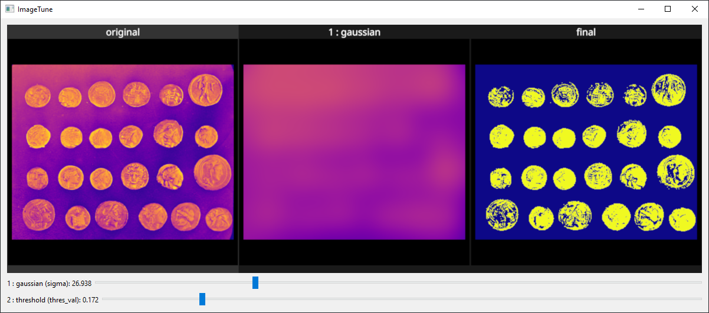

# IMAGETUNE

`imagetune` is a simple GUI to interactively tune image-processing parameters.


Here is a simple script to make a binary version of an image:

```python
from skimage.filters import gaussian
from skimage import data


def threshold(im, thres_val):
    return im > thres_val


def preprocessing(im):
    bg = gaussian(im, 10)
    fg = im - bg
    segmented = threshold(fg, 0.1)
    return segmented


im = data.coins()
result = preprocessing(im)
```

The script depends on parameters, `sigma=10` for Gaussian filtering and `thres_val=0.1` for the thresholding.
In order to tune these live, simply wrap those functions in `tune`:

```diff
from skimage.filters import gaussian
from skimage import data
+from imagetune import tune, tuneui


def threshold(im, thres_val):
    return im > thres_val


def preprocessing(im):
+    bg = tune(gaussian)(im, 10)
    fg = im - bg
+    segmented = tune(threshold)(fg, 0.1)
    return segmented


im = data.coins()
+tuneui(preprocessing, im)
```

This launches a small window in which the parameters are tunable live:



You can also decorate your functions instead

```diff
+@tune
def threshold(im, thres_val):
    return im > thres_val
```
